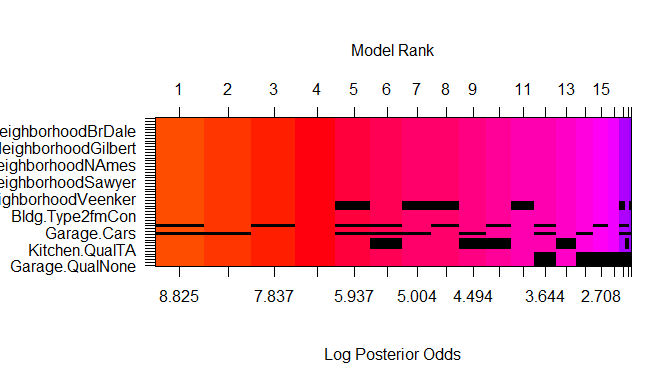

-   [Background](#background)
-   [Training Data and relevant
    packages](#training-data-and-relevant-packages)
    -   [Part 1 - Exploratory Data Analysis
        (EDA)](#part-1---exploratory-data-analysis-eda)
    -   [Part 2 - Development and assessment of an initial model,
        following a semi-guided process of
        analysis](#part-2---development-and-assessment-of-an-initial-model-following-a-semi-guided-process-of-analysis)
        -   [Section 2.1 An Initial
            Model](#section-2.1-an-initial-model)
        -   [Section 2.2 Model Selection](#section-2.2-model-selection)
        -   [Section 2.3 Initial Model
            Residuals](#section-2.3-initial-model-residuals)
        -   [Section 2.4 Initial Model
            RMSE](#section-2.4-initial-model-rmse)
        -   [Section 2.5 Overfitting](#section-2.5-overfitting)
    -   [Part 3 Development of a Final
        Model](#part-3-development-of-a-final-model)
        -   [Section 3.1 Final Model](#section-3.1-final-model)
        -   [Section 3.2 Transformation](#section-3.2-transformation)
        -   [Section 3.3 Variable
            Interaction](#section-3.3-variable-interaction)
        -   [Section 3.4 Variable
            Selection](#section-3.4-variable-selection)
        -   [Section 3.5 Model Testing](#section-3.5-model-testing)
    -   [Part 4 Final Model Assessment](#part-4-final-model-assessment)
        -   [Section 4.1 Final Model
            Evaluation](#section-4.1-final-model-evaluation)
        -   [Section 4.2 Final Model
            Validation](#section-4.2-final-model-validation)
    -   [Part 5 Conclusion](#part-5-conclusion)
    -   [Appendix](#appendix)

Background
==========

As a statistical consultant working for a real estate investment firm,
your task is to develop a model to predict the selling price of a given
home in Ames, Iowa. Your employer hopes to use this information to help
assess whether the asking price of a house is higher or lower than the
true value of the house. If the home is undervalued, it may be a good
investment for the firm.

Training Data and relevant packages
===================================

In order to better assess the quality of the model you will produce, the
data have been randomly divided into three separate pieces: a training
data set, a testing data set, and a validation data set. For now we will
load the training data set, the others will be loaded and used later.

``` r
load("ames_train") 
load("ames_test") 
load("ames_validation")
```

``` r
library(ggplot2)
library(statsr)
library(dplyr)
library(BAS)
library(GGally)    
library(gridExtra)
library(MASS)
```

Part 1 - Exploratory Data Analysis (EDA)
----------------------------------------

When you first get your data, it’s very tempting to immediately begin
fitting models and assessing how they perform. However, before you begin
modeling, it’s absolutely essential to explore the structure of the data
and the relationships between the variables in the data set.

------------------------------------------------------------------------

I have completed EDA of the ames\_train data set, to learn about the
structure of the data and the relationships between the variables in the
data set. Below 3 plots I found most informative during EDA process.

The mantra in real estate is “Location, Location, Location!”. The median
is preferred in this summary statistic due to high variability and
outliers.

``` r
ggplot(data = ames_train, aes(x = reorder(Neighborhood, price, FUN=median), y = price/1000, group = Neighborhood)) +
  geom_boxplot(fill="lightgreen", varwidth = TRUE)  +
  labs(y = "Price in thousands", x = "Neighborhood", title = "Price range by Neighborhood")   +
  theme(axis.text.x = element_text(angle = 90, vjust = 0.5, hjust=0.5))
```


The below summary statistics shows that NridgHt($305,500) and
StoneBr($255,500) Neighborhood are the most expensive, as well as the
most heterogenous neighborhoods.

``` r
ames_location <-ames_train%>%
  dplyr::select(price, Year.Built, Neighborhood) %>%
  group_by(Neighborhood)%>%
  summarise(max = max(price), min = min(price), median = median(price), sd = sd(price), year = median(Year.Built))

arrange(ames_location, desc(median, sd))  %>% head()
```

    ## # A tibble: 6 x 6
    ##   Neighborhood    max    min median      sd  year
    ##   <fct>         <int>  <int>  <dbl>   <dbl> <dbl>
    ## 1 NridgHt      615000 173000 305500 105806.  2005
    ## 2 NoRidge      405000 235000 290000  35889.  1994
    ## 3 GrnHill      330000 230000 280000  70711.  1992
    ## 4 StoneBr      538000 180000 255500 104622.  2000
    ## 5 Timber       425000 176000 232500  82153.  2002
    ## 6 Somerst      468000 139000 220000  62416.  2004

MeadowV($85,750) and BrDale($100,500) are in opposite having the lowest
median price with much older houses in the area.

``` r
arrange(ames_location, median) %>% head()
```

    ## # A tibble: 6 x 6
    ##   Neighborhood    max    min median     sd  year
    ##   <fct>         <int>  <int>  <dbl>  <dbl> <dbl>
    ## 1 MeadowV      129500  73000  85750 18940.  1971
    ## 2 BrDale       125500  83000 100500 13596.  1972
    ## 3 IDOTRR       141000  40000 103000 26438.  1927
    ## 4 OldTown      265979  45000 120000 34944.  1920
    ## 5 Blueste      137000 116500 123900 10381.  1980
    ## 6 BrkSide      207000  39300 125250 38466.  1928

The overall material and finish of the house is usually higher for the
newer houses, thus the price is positively correlated.

``` r
ggplot(data = ames_train, aes(y = price/1000, x = Year.Built, color =  Overall.Qual)) +  
  geom_point(alpha = 0.5) + 
  stat_smooth( method = "lm") +
  scale_colour_gradientn(colours = terrain.colors(10)) +
  ggtitle("Price distribution by Year Built and Overall Quality") +
  ylab("Price (thousands of dollars)")
```


The below plot represents price distribution among different dwelling
types. Single-family detached houses have the speepest slope, while
2-family houses originally built as a one-family dwelling has the lowest
slope.

``` r
ggplot(data = ames_train, aes(x = area, y = price/1000, color = Bldg.Type)) +  
  geom_point(alpha = 0.6) + 
  stat_smooth( method = "lm") +
  scale_colour_discrete( 
                       name="Type of Dwelling",
                       breaks=c("1Fam", "2fmCon","Duplex", "Twnhs", "TwnhsE"),
                       labels=c("Single - family Detached","Two-family Conversation","Duplex", "Townhouse End Unit", "Townhouse Inside Unit")) +
   ylab("Price (thousands of dollars)")
```


Here we reviewed only 3 plots with 4 variables, but the data set has
many more interesting variables to review and use in the modeling. Below
correlation matrix will help to identify variables for further modeling.

``` r
ggcorr(ames_train[,c(2,3:77)], size = 3, angle = 90, hjust = 0, nbreaks = 6)
```

    ## Warning in ggcorr(ames_train[, c(2, 3:77)], size = 3, angle = 90, hjust = 0, :
    ## data in column(s) 'MS.Zoning', 'Street', 'Alley', 'Lot.Shape', 'Land.Contour',
    ## 'Utilities', 'Lot.Config', 'Land.Slope', 'Neighborhood', 'Condition.1',
    ## 'Condition.2', 'Bldg.Type', 'House.Style', 'Roof.Style', 'Roof.Matl', 'Exterior.
    ## 1st', 'Exterior.2nd', 'Mas.Vnr.Type', 'Exter.Qual', 'Exter.Cond', 'Foundation',
    ## 'Bsmt.Qual', 'Bsmt.Cond', 'Bsmt.Exposure', 'Heating', 'Heating.QC',
    ## 'Central.Air', 'Electrical', 'Kitchen.Qual', 'Functional', 'Fireplace.Qu',
    ## 'Garage.Type', 'Garage.Finish', 'Garage.Qual', 'Garage.Cond', 'Paved.Drive',
    ## 'Pool.QC', 'Fence', 'Sale.Type' are not numeric and were ignored


``` r
ggpairs(ames_train[,c(2,17)], lower = list(continuous='smooth')) +
        theme(axis.text.x = element_text(angle = 90, hjust = 1),
              axis.text.y = element_text(angle = 45, hjust = 1)
              )
```

    ## `stat_bin()` using `bins = 30`. Pick better value with `binwidth`.


``` r
ggpairs(ames_train[,c(2,18)], lower = list(continuous='smooth')) +
        theme(axis.text.x = element_text(angle = 90, hjust = 1),
              axis.text.y = element_text(angle = 45, hjust = 1)
              )
```

    ## `stat_bin()` using `bins = 30`. Pick better value with `binwidth`.


``` r
ggpairs(ames_train[,c(2,29)], lower = list(continuous='smooth')) +
        theme(axis.text.x = element_text(angle = 90, hjust = 1),
              axis.text.y = element_text(angle = 45, hjust = 1)
              )
```

    ## `stat_bin()` using `bins = 30`. Pick better value with `binwidth`.


``` r
ggpairs(ames_train[,c(2,32)], lower = list(continuous='smooth')) +
        theme(axis.text.x = element_text(angle = 90, hjust = 1),
              axis.text.y = element_text(angle = 45, hjust = 1)
              )
```

    ## `stat_bin()` using `bins = 30`. Pick better value with `binwidth`.


``` r
ggpairs(ames_train[,c(2,54)], lower = list(continuous='smooth')) +
        theme(axis.text.x = element_text(angle = 90, hjust = 1),
              axis.text.y = element_text(angle = 45, hjust = 1)
              ) 
```

    ## `stat_bin()` using `bins = 30`. Pick better value with `binwidth`.


------------------------------------------------------------------------

Part 2 - Development and assessment of an initial model, following a semi-guided process of analysis
----------------------------------------------------------------------------------------------------

### Section 2.1 An Initial Model

In building a model, it is often useful to start by creating a simple,
intuitive initial model based on the results of the exploratory data
analysis.

Based on EDA, I selected following variables for the initial model:

<table>
<colgroup>
<col style="width: 14%" />
<col style="width: 85%" />
</colgroup>
<thead>
<tr class="header">
<th>Variable</th>
<th>Description</th>
</tr>
</thead>
<tbody>
<tr class="odd">
<td>Lot.Area</td>
<td>Lot size in square feet. Land size is highly correlated with price.</td>
</tr>
<tr class="even">
<td>area</td>
<td>Living area square feet. House size is highly correlated with price.</td>
</tr>
<tr class="odd">
<td>Neighborhood</td>
<td>Physical locations within Ames city limits. Location is very important for many buyers. The above EDA shows different price range in different Neighborhood.</td>
</tr>
<tr class="even">
<td>Overall.Qual</td>
<td>Rates the overall material and finish of the house. The quality of material, and it’s condition influence the price</td>
</tr>
<tr class="odd">
<td>Year.Built</td>
<td>Original construction date. Newer houses cost more.</td>
</tr>
<tr class="even">
<td>Bldg.Type</td>
<td>Type of dwelling. EDA above shows that dwelling type is very important.</td>
</tr>
<tr class="odd">
<td>TotRms.AbvGrd</td>
<td>Total rooms above grade (does NOT include bathrooms). Number of rooms is very important for big families.</td>
</tr>
<tr class="even">
<td>Garage.Cars</td>
<td>Size of garage in car capacity.</td>
</tr>
<tr class="odd">
<td>Full.Bath</td>
<td>Full bathrooms above grade. Number of bathroom is another important feature. EDA shows houses with 2 bathroom are a bit more expensive than houses with 1 bathroom</td>
</tr>
<tr class="even">
<td>Half.Bath</td>
<td>Half baths above grade. EDA shows houses with 2 bathroom are a bit more expensive than houses with 1 bathroom</td>
</tr>
</tbody>
</table>

The logarithmic transformation will be used for the price and Lot.Area
variables due to their skewness. By using the logarithm of variable, we
obtain a more normally distributed variable that is more suitable for
liniar regression modeling. The area variable is right skewed as well,
but the model performs better without log(area).

``` r
# Lograrithmic transformation
ames_train <- ames_train %>% 
  mutate(log_price=log(price), log_area = log(area), log_lotarea = log(Lot.Area))

df.initial.model <- dplyr::select(ames_train, 
                                  log_price,
                                  log_lotarea,
                                  area,
                                  Neighborhood,
                                  Overall.Qual,
                                  Year.Built,
                                  Bldg.Type,
                                  TotRms.AbvGrd,
                                  Garage.Cars,
                                  Full.Bath, 
                                  Bsmt.Full.Bath)

initial.model <- lm(log_price ~ . - log_price,data = df.initial.model)  
 
summary(initial.model) 
```

    ## 
    ## Call:
    ## lm(formula = log_price ~ . - log_price, data = df.initial.model)
    ## 
    ## Residuals:
    ##      Min       1Q   Median       3Q      Max 
    ## -0.86756 -0.06053  0.00163  0.07447  0.37552 
    ## 
    ## Coefficients:
    ##                       Estimate Std. Error t value Pr(>|t|)    
    ## (Intercept)          4.014e+00  7.152e-01   5.613 2.75e-08 ***
    ## log_lotarea          9.573e-02  1.385e-02   6.911 9.88e-12 ***
    ## area                 3.092e-04  1.934e-05  15.983  < 2e-16 ***
    ## NeighborhoodBlueste -6.712e-02  8.565e-02  -0.784 0.433421    
    ## NeighborhoodBrDale  -1.763e-01  6.995e-02  -2.521 0.011902 *  
    ## NeighborhoodBrkSide -7.900e-02  5.841e-02  -1.352 0.176630    
    ## NeighborhoodClearCr -2.288e-02  6.461e-02  -0.354 0.723371    
    ## NeighborhoodCollgCr -1.043e-01  5.221e-02  -1.997 0.046140 *  
    ## NeighborhoodCrawfor  4.249e-02  5.844e-02   0.727 0.467383    
    ## NeighborhoodEdwards -1.465e-01  5.471e-02  -2.677 0.007571 ** 
    ## NeighborhoodGilbert -1.411e-01  5.426e-02  -2.601 0.009477 ** 
    ## NeighborhoodGreens   2.662e-02  7.734e-02   0.344 0.730819    
    ## NeighborhoodGrnHill  3.383e-01  9.769e-02   3.463 0.000563 ***
    ## NeighborhoodIDOTRR  -1.817e-01  6.010e-02  -3.023 0.002583 ** 
    ## NeighborhoodMeadowV -1.623e-01  5.837e-02  -2.780 0.005571 ** 
    ## NeighborhoodMitchel -7.492e-02  5.427e-02  -1.380 0.167870    
    ## NeighborhoodNAmes   -6.043e-02  5.359e-02  -1.128 0.259818    
    ## NeighborhoodNoRidge -8.030e-02  5.547e-02  -1.448 0.148124    
    ## NeighborhoodNPkVill -2.598e-02  7.855e-02  -0.331 0.740941    
    ## NeighborhoodNridgHt  1.560e-02  5.248e-02   0.297 0.766387    
    ## NeighborhoodNWAmes  -1.117e-01  5.455e-02  -2.047 0.040954 *  
    ## NeighborhoodOldTown -1.165e-01  5.822e-02  -2.001 0.045684 *  
    ## NeighborhoodSawyer  -9.030e-02  5.484e-02  -1.647 0.100007    
    ## NeighborhoodSawyerW -1.575e-01  5.329e-02  -2.955 0.003215 ** 
    ## NeighborhoodSomerst -3.205e-02  5.081e-02  -0.631 0.528352    
    ## NeighborhoodStoneBr -2.966e-02  5.839e-02  -0.508 0.611612    
    ## NeighborhoodSWISU   -1.493e-01  6.686e-02  -2.233 0.025814 *  
    ## NeighborhoodTimber  -3.932e-02  5.849e-02  -0.672 0.501634    
    ## NeighborhoodVeenker -1.106e-02  6.448e-02  -0.172 0.863844    
    ## Overall.Qual         9.292e-02  5.434e-03  17.100  < 2e-16 ***
    ## Year.Built           3.114e-03  3.503e-04   8.891  < 2e-16 ***
    ## Bldg.Type2fmCon     -5.164e-02  3.070e-02  -1.682 0.092931 .  
    ## Bldg.TypeDuplex     -1.521e-01  2.645e-02  -5.751 1.27e-08 ***
    ## Bldg.TypeTwnhs      -7.639e-02  3.394e-02  -2.251 0.024673 *  
    ## Bldg.TypeTwnhsE     -3.497e-02  2.363e-02  -1.480 0.139177    
    ## TotRms.AbvGrd       -4.043e-03  5.343e-03  -0.757 0.449456    
    ## Garage.Cars          3.841e-02  8.312e-03   4.621 4.46e-06 ***
    ## Full.Bath           -7.394e-03  1.295e-02  -0.571 0.568294    
    ## Bsmt.Full.Bath       8.698e-02  8.929e-03   9.741  < 2e-16 ***
    ## ---
    ## Signif. codes:  0 '***' 0.001 '**' 0.01 '*' 0.05 '.' 0.1 ' ' 1
    ## 
    ## Residual standard error: 0.1192 on 795 degrees of freedom
    ## Multiple R-squared:  0.907,  Adjusted R-squared:  0.9026 
    ## F-statistic: 204.1 on 38 and 795 DF,  p-value: < 2.2e-16

This model does a pretty good job of prediction with an R-squared value
of 0.907. R-squared is a statistical measure of how close the data are
to the fitted regression line. R-squared closure to indicates that the
model explains the variability of the response data around its mean.

------------------------------------------------------------------------

### Section 2.2 Model Selection

In this section I will use stepwise selection procedure to choose the
“best” model based on initial model. I will use AIC and BIC methods and
compare results. Additionally, I will use `BAS` R package and Bayesian
model averaging (BMA), which involves averaging over many possible
models. BMA can be used for prediction, averaging predictions from
multiple models according to their posterior probabilities.

``` r
initial.model.BIC <- bas.lm(
                    log_price ~ 
                    log_lotarea +
                    area +
                    Neighborhood +
                    Overall.Qual +
                    Year.Built +
                    Bldg.Type +
                    TotRms.AbvGrd +
                    Garage.Cars +
                    Bsmt.Full.Bath +
                    Full.Bath
                    ,data = ames_train, prior = "BIC", modelprior=uniform())
```

    ## Warning in model.matrix.default(mt, mf, contrasts): non-list contrasts argument
    ## ignored

``` r
predict.train.initial.model.BIC <- predict(initial.model.BIC, newdata = ames_train, estimator="BMA")

ames_train <- ames_train %>% mutate(
  res.log_price = log_price - predict.train.initial.model.BIC$fit,
  predicted.price = price / exp(res.log_price),
  residual = price - predicted.price,
  predicted.log.price = predict.train.initial.model.BIC$fit
)

r2 = 1 - sum(ames_train$res.log_price^2)/sum((ames_train$log_price-mean(ames_train$log_price))^2)
r2
```

    ## [1] 0.8892251

*B**I**C*: *R*<sup>2</sup> = 0.8892

``` r
image(initial.model.BIC, rotate = F) 
```


``` r
initial.model.AIC <- bas.lm(
                    log_price ~ 
                    log_lotarea +
                    area +
                    Neighborhood +
                    Overall.Qual +
                    Year.Built +
                    Bldg.Type +
                    TotRms.AbvGrd +
                    Garage.Cars +
                    Bsmt.Full.Bath +
                    Full.Bath
                    ,data = ames_train, prior = "AIC", modelprior=uniform())
```

    ## Warning in model.matrix.default(mt, mf, contrasts): non-list contrasts argument
    ## ignored

``` r
predict.train.initial.model.AIC <- predict(initial.model.AIC, newdata = ames_train, estimator="BMA")

ames_train <- ames_train %>% mutate(
  res.log_price = log_price - predict.train.initial.model.AIC$fit,
  predicted.price = price / exp(res.log_price),
  residual = price - predicted.price,
  predicted.log.price = predict.train.initial.model.AIC$fit
)

r2 = 1 - sum(ames_train$res.log_price^2)/sum((ames_train$log_price-mean(ames_train$log_price))^2)
r2
```

    ## [1] 0.906966

``` r
round(summary(initial.model.AIC),2)
```

    ##                     P(B != 0 | Y)  model 1  model 2  model 3  model 4  model 5
    ## Intercept                    1.00     1.00     1.00     1.00     1.00     1.00
    ## log_lotarea                  1.00     1.00     1.00     1.00     1.00     1.00
    ## area                         1.00     1.00     1.00     1.00     1.00     1.00
    ## NeighborhoodBlueste          1.00     1.00     1.00     1.00     1.00     1.00
    ## NeighborhoodBrDale           1.00     1.00     1.00     1.00     1.00     1.00
    ## NeighborhoodBrkSide          1.00     1.00     1.00     1.00     1.00     1.00
    ## NeighborhoodClearCr          1.00     1.00     1.00     1.00     1.00     1.00
    ## NeighborhoodCollgCr          1.00     1.00     1.00     1.00     1.00     1.00
    ## NeighborhoodCrawfor          1.00     1.00     1.00     1.00     1.00     1.00
    ## NeighborhoodEdwards          1.00     1.00     1.00     1.00     1.00     1.00
    ## NeighborhoodGilbert          1.00     1.00     1.00     1.00     1.00     1.00
    ## NeighborhoodGreens           1.00     1.00     1.00     1.00     1.00     1.00
    ## NeighborhoodGrnHill          1.00     1.00     1.00     1.00     1.00     1.00
    ## NeighborhoodIDOTRR           1.00     1.00     1.00     1.00     1.00     1.00
    ## NeighborhoodMeadowV          1.00     1.00     1.00     1.00     1.00     1.00
    ## NeighborhoodMitchel          1.00     1.00     1.00     1.00     1.00     1.00
    ## NeighborhoodNAmes            1.00     1.00     1.00     1.00     1.00     1.00
    ## NeighborhoodNoRidge          1.00     1.00     1.00     1.00     1.00     1.00
    ## NeighborhoodNPkVill          1.00     1.00     1.00     1.00     1.00     1.00
    ## NeighborhoodNridgHt          1.00     1.00     1.00     1.00     1.00     1.00
    ## NeighborhoodNWAmes           1.00     1.00     1.00     1.00     1.00     1.00
    ## NeighborhoodOldTown          1.00     1.00     1.00     1.00     1.00     1.00
    ## NeighborhoodSawyer           1.00     1.00     1.00     1.00     1.00     1.00
    ## NeighborhoodSawyerW          1.00     1.00     1.00     1.00     1.00     1.00
    ## NeighborhoodSomerst          1.00     1.00     1.00     1.00     1.00     1.00
    ## NeighborhoodStoneBr          1.00     1.00     1.00     1.00     1.00     1.00
    ## NeighborhoodSWISU            1.00     1.00     1.00     1.00     1.00     1.00
    ## NeighborhoodTimber           1.00     1.00     1.00     1.00     1.00     1.00
    ## NeighborhoodVeenker          1.00     1.00     1.00     1.00     1.00     1.00
    ## Overall.Qual                 1.00     1.00     1.00     1.00     1.00     1.00
    ## Year.Built                   1.00     1.00     1.00     1.00     1.00     1.00
    ## Bldg.Type2fmCon              1.00     1.00     1.00     1.00     1.00     1.00
    ## Bldg.TypeDuplex              1.00     1.00     1.00     1.00     1.00     1.00
    ## Bldg.TypeTwnhs               1.00     1.00     1.00     1.00     1.00     1.00
    ## Bldg.TypeTwnhsE              1.00     1.00     1.00     1.00     1.00     1.00
    ## TotRms.AbvGrd                0.34     0.00     1.00     0.00     1.00     0.00
    ## Garage.Cars                  1.00     1.00     1.00     1.00     1.00     0.00
    ## Bsmt.Full.Bath               1.00     1.00     1.00     1.00     1.00     1.00
    ## Full.Bath                    0.31     0.00     0.00     1.00     1.00     0.00
    ## BF                             NA     1.00     0.51     0.45     0.22     0.00
    ## PostProbs                      NA     0.46     0.23     0.21     0.10     0.00
    ## R2                             NA     0.91     0.91     0.91     0.91     0.90
    ## dim                            NA    37.00    38.00    38.00    39.00    36.00
    ## logmarg                        NA -1048.52 -1049.18 -1049.31 -1050.01 -1058.76

*A**I**C*: *R*<sup>2</sup> = 0.9069

``` r
image(initial.model.AIC, rotate = F) 
```


The AIC model has higher Adjusted R-squared 0.907 compare to BIC model
with Adjusted R-squared 0.8892.

BIC model has lesser predictor variables resulting in more parsimonious
model which is great for interpretation. But BIC is best for explanation
as it is allows consistent estimation of the underlying data generating
process.

The model using AIC as criteria using more predictor varibales which is
better to maximize predictive discrimination.

As the main purpose of the assessment is predicting the price, I will
chose the AIC model as it fulfills objective better.

------------------------------------------------------------------------

### Section 2.3 Initial Model Residuals

One way to assess the performance of a model is to examine the model’s
residuals.

``` r
plot(initial.model.AIC, which = c(1,4) )
```


``` r
layout(matrix(c(1,2), 1, 2, byrow = TRUE))
hist(ames_train$log_price - ames_train$predicted.log.price, breaks = 30)
qqnorm(ames_train$log_price - ames_train$predicted.log.price)
qqline(ames_train$log_price - ames_train$predicted.log.price) 
```


The model has few outliers:

-   611 is a Commercial property. Having only 5 comercial properties in
    the data set, we have not enough observations, and therefore the
    price is overpredicted.

-   423 has garage in Poor quality, the variable Garage.Qual will be
    included in the final model.

Other than heavy tails on the normal distribution of the residuals (the
difference between the observed value and the predicted value), there
does not appear to exist any major assumption violation in the residuals
plot. As the sample number is quite large, it should not be a problem.

------------------------------------------------------------------------

### Section 2.4 Initial Model RMSE

In general, the better the model fits, the lower RMSE. The residuals
from the initial model exhibit a standard deviation, and RMSE is
$20,143.

``` r
ames.train.initial.rmse <- sqrt(mean((ames_train$residual)^2))
ames.train.initial.rmse
```

    ## [1] 20143.01

------------------------------------------------------------------------

### Section 2.5 Overfitting

We next test the initial model with out-of-sample data. This will give
indication if the model perform well or not (“overfitting”).

In order to run the model on a test data set we need to remove 1
property from ames\_test in the Landmrk Neighbohood as it was not
represented on ames\_test. Without re-training, the model cannot
accomodate a new neighbohood.

The model achieves *R*<sup>2</sup> = 0.9069 with RMSE of $20,143.
Compared to results in training, that is a 1.34% decrease in
*R*<sup>2</sup> and a $1,068 increase in RMSE. These differences are
reasonable, and yield a successful test of our model on out-of-sample
data.

``` r
ames_test <- ames_test %>%
  filter(Neighborhood != 'Landmrk')

ames_test <- ames_test %>% 
  mutate(log_price=log(price), log_area = log(area), log_lotarea = log(Lot.Area))

initial.test.model.AIC <- predict(initial.model.AIC, newdata = ames_test, estimator="BMA")

ames_test <- ames_test %>% mutate(
  res.log_price = log_price - initial.test.model.AIC$fit,
  predicted.price = price / exp(res.log_price),
  residual = price - predicted.price,
  predicted.log.price = initial.test.model.AIC$fit
)

r2 = 1 - sum(ames_test$res.log_price^2)/sum((ames_test$log_price-mean(ames_test$log_price))^2)
r2
```

    ## [1] 0.8950198

``` r
ames.test.initial.rmse <- sqrt(mean((ames_test$residual)^2))
ames.test.initial.rmse
```

    ## [1] 21211.57

Residuals distribution is very similar to the initial model.

``` r
plot(ames_test$log_price - ames_test$predicted.log.price, main = 'Residuals')
```


``` r
layout(matrix(c(1,2), 1, 2, byrow = TRUE))
hist(ames_test$log_price - ames_test$predicted.log.price, breaks = 10)
qqnorm(ames_test$log_price - ames_test$predicted.log.price)
qqline(ames_test$log_price - ames_test$predicted.log.price)
```


Part 3 Development of a Final Model
-----------------------------------

### Section 3.1 Final Model

The final model has *R*<sup>2</sup> = 0.94 and RSME = $16,187. Compared
to the initial model, that is a 18.9% decrease in RMSE.

There is not much trouble with outliers, which were discussed in the
initial model testing.

``` r
final.model.AIC <- bas.lm(log_price ~ 
                   log_lotarea +
                   area +
                   Neighborhood +
                   Overall.Qual +
                   Exter.Qual+
                   Year.Built +
                   Bldg.Type  + 
                   TotRms.AbvGrd +
                   Overall.Cond +
                   Garage.Cars +
                   Full.Bath +
                   Bsmt.Full.Bath +
                   Kitchen.Qual + 
                   Total.Bsmt.SF +
                   Garage.Qual,
                   data = ames_train, 
                   prior = "AIC", modelprior=uniform())  
```

    ## Warning in model.matrix.default(mt, mf, contrasts): non-list contrasts argument
    ## ignored

``` r
image(final.model.AIC, rotate = F)  
```



``` r
round(summary(final.model.AIC),2)
```

    ##                     P(B != 0 | Y) model 1 model 2 model 3 model 4 model 5
    ## Intercept                    1.00    1.00    1.00    1.00    1.00    1.00
    ## log_lotarea                  1.00    1.00    1.00    1.00    1.00    1.00
    ## area                         1.00    1.00    1.00    1.00    1.00    1.00
    ## NeighborhoodBlueste          1.00    1.00    1.00    1.00    1.00    1.00
    ## NeighborhoodBrDale           1.00    1.00    1.00    1.00    1.00    1.00
    ## NeighborhoodBrkSide          1.00    1.00    1.00    1.00    1.00    1.00
    ## NeighborhoodClearCr          1.00    1.00    1.00    1.00    1.00    1.00
    ## NeighborhoodCollgCr          1.00    1.00    1.00    1.00    1.00    1.00
    ## NeighborhoodCrawfor          1.00    1.00    1.00    1.00    1.00    1.00
    ## NeighborhoodEdwards          1.00    1.00    1.00    1.00    1.00    1.00
    ## NeighborhoodGilbert          1.00    1.00    1.00    1.00    1.00    1.00
    ## NeighborhoodGreens           1.00    1.00    1.00    1.00    1.00    1.00
    ## NeighborhoodGrnHill          1.00    1.00    1.00    1.00    1.00    1.00
    ## NeighborhoodIDOTRR           1.00    1.00    1.00    1.00    1.00    1.00
    ## NeighborhoodMeadowV          1.00    1.00    1.00    1.00    1.00    1.00
    ## NeighborhoodMitchel          1.00    1.00    1.00    1.00    1.00    1.00
    ## NeighborhoodNAmes            1.00    1.00    1.00    1.00    1.00    1.00
    ## NeighborhoodNoRidge          1.00    1.00    1.00    1.00    1.00    1.00
    ## NeighborhoodNPkVill          1.00    1.00    1.00    1.00    1.00    1.00
    ## NeighborhoodNridgHt          1.00    1.00    1.00    1.00    1.00    1.00
    ## NeighborhoodNWAmes           1.00    1.00    1.00    1.00    1.00    1.00
    ## NeighborhoodOldTown          1.00    1.00    1.00    1.00    1.00    1.00
    ## NeighborhoodSawyer           1.00    1.00    1.00    1.00    1.00    1.00
    ## NeighborhoodSawyerW          1.00    1.00    1.00    1.00    1.00    1.00
    ## NeighborhoodSomerst          1.00    1.00    1.00    1.00    1.00    1.00
    ## NeighborhoodStoneBr          1.00    1.00    1.00    1.00    1.00    1.00
    ## NeighborhoodSWISU            1.00    1.00    1.00    1.00    1.00    1.00
    ## NeighborhoodTimber           1.00    1.00    1.00    1.00    1.00    1.00
    ## NeighborhoodVeenker          1.00    1.00    1.00    1.00    1.00    1.00
    ## Overall.Qual                 1.00    1.00    1.00    1.00    1.00    1.00
    ## Exter.QualFa                 0.95    1.00    1.00    1.00    1.00    0.00
    ## Exter.QualGd                 0.95    1.00    1.00    1.00    1.00    0.00
    ## Exter.QualTA                 0.95    1.00    1.00    1.00    1.00    0.00
    ## Year.Built                   1.00    1.00    1.00    1.00    1.00    1.00
    ## Bldg.Type2fmCon              1.00    1.00    1.00    1.00    1.00    1.00
    ## Bldg.TypeDuplex              1.00    1.00    1.00    1.00    1.00    1.00
    ## Bldg.TypeTwnhs               1.00    1.00    1.00    1.00    1.00    1.00
    ## Bldg.TypeTwnhsE              1.00    1.00    1.00    1.00    1.00    1.00
    ## TotRms.AbvGrd                0.30    0.00    1.00    0.00    1.00    0.00
    ## Overall.Cond                 1.00    1.00    1.00    1.00    1.00    1.00
    ## Garage.Cars                  1.00    1.00    1.00    1.00    1.00    1.00
    ## Full.Bath                    0.27    0.00    0.00    1.00    1.00    0.00
    ## Bsmt.Full.Bath               1.00    1.00    1.00    1.00    1.00    1.00
    ## Kitchen.QualFa               0.97    1.00    1.00    1.00    1.00    1.00
    ## Kitchen.QualGd               0.97    1.00    1.00    1.00    1.00    1.00
    ## Kitchen.QualPo               0.97    1.00    1.00    1.00    1.00    1.00
    ## Kitchen.QualTA               0.97    1.00    1.00    1.00    1.00    1.00
    ## Total.Bsmt.SF                1.00    1.00    1.00    1.00    1.00    1.00
    ## Garage.QualFa                0.99    1.00    1.00    1.00    1.00    1.00
    ## Garage.QualGd                0.99    1.00    1.00    1.00    1.00    1.00
    ## Garage.QualPo                0.99    1.00    1.00    1.00    1.00    1.00
    ## Garage.QualTA                0.99    1.00    1.00    1.00    1.00    1.00
    ## Garage.QualNone              0.99    1.00    1.00    1.00    1.00    1.00
    ## BF                             NA    1.00    0.42    0.37    0.16    0.06
    ## PostProbs                      NA    0.47    0.20    0.17    0.07    0.03
    ## R2                             NA    0.94    0.94    0.94    0.94    0.94
    ## dim                            NA   51.00   52.00   52.00   53.00   48.00
    ## logmarg                        NA -868.12 -868.97 -869.11 -869.97 -871.01

``` r
predict.train.final.model.AIC <- predict(final.model.AIC, newdata = ames_train, estimator="BMA")

ames_train <- ames_train %>% mutate( 
  res.log_price = log_price - predict.train.final.model.AIC$fit,
  predicted.price = price / exp(res.log_price),
  residual = price - predicted.price,
  predicted.log.price = predict.train.final.model.AIC$fit)

r2 = 1 - sum(ames_train$res.log_price^2)/sum((ames_train$log_price-mean(ames_train$log_price))^2)
r2
```

    ## [1] 0.9415994

``` r
ames_train_rmse <- sqrt(mean((ames_train$residual)^2))
ames_train_rmse
```

    ## [1] 16187.84

``` r
plot(final.model.AIC, which = 1 )
```


``` r
layout(matrix(c(1,2), 1, 2, byrow = TRUE))
hist(ames_train$log_price - ames_train$predicted.log.price, breaks = 30)
qqnorm(ames_train$log_price - ames_train$predicted.log.price)
qqline(ames_train$log_price - ames_train$predicted.log.price)
```


------------------------------------------------------------------------

### Section 3.2 Transformation

As mentioned in the Section 2.1 the following variables were
log-transformed: price and Lot.Area. The reason for doing it is that all
of them are right skewed. It was mentioned that the area variable
performs bit better than log(area).

Misc.Feature, Misc.Val, PID cannot be generalized to be used as a
meaningful variable, so they were supressed.

Variables with missing value were replaced to None or 0 value according
to variable type.

As houses with non-normal selling condition exhibit atypical behavior
and can disproportionately influence the model, the model was built for
only normal sale condition.

### Section 3.3 Variable Interaction

Interaction effects occur when the effect of one variable depends on the
value of another variable. Interaction effects are common in regression
analysis, ANOVA, and designed experiments. Variable interactions were
not included in the model.

### Section 3.4 Variable Selection

Home price is determined by its location, its size, its age and its
quality. As location variable, I choose Neighborhood. As size variables,
I included area, log(Lot.Area), Basement square feet “Total.Bsmt.SF”“.
As age variable I included”Year.Built“. As quality variables, I included
“Overall.Qual”, “Overall.Cond”, “Kitchen.Qual”, “Garage.Qual”,
“Exter.Qual”, “Full.Bath” and “Bsmt.Full.Bath”.

I used the backward elimination BIC and AIC methods. AIC model performed
better, while BIC was having more parsimonious model. As the main
purpose of the project is predicting the price, I chose the AIC model as
it fulfills objective better. Additionally, Bayesian model averaging
(BMA) is utilised for averaging over many possible models.

Some variables are not included due to remote relationship to the price,
some other variables are not included due to the collinearity with
variables which are included in this model. For example, Garage.Cars and
Garage.Area are correlated, so only Garage.Cars was used in the model.

### Section 3.5 Model Testing

How did testing the model on out-of-sample data affect whether or how
you changed your model? Explain in a few sentences.

The model achieves *R*<sup>2</sup> = 0.9268 with RMSE of $17,842.
Compared to results in training, that is a 1.4% decrease in
*R*<sup>2</sup> and a $1,655 increase in RMSE. These differences are
reasonable, and yield a successful test of our model on out-of-sample
data.

``` r
final.test.model.AIC <- predict(final.model.AIC, newdata = ames_test, estimator="BMA")

ames_test <- ames_test %>% mutate(
  res.log_price = log_price - final.test.model.AIC$fit,
  predicted.price = price / exp(res.log_price),
  residual = price - predicted.price,
  predicted.log.price = final.test.model.AIC$fit
)

r2 = 1 - sum(ames_test$res.log_price^2)/sum((ames_test$log_price-mean(ames_test$log_price))^2)
r2
```

    ## [1] 0.9268533

``` r
ames.test.final.rmse <- sqrt(mean((ames_test$residual)^2))
ames.test.final.rmse
```

    ## [1] 17842.33

``` r
plot(ames_test$res.log_price, main= 'Residulas')
```


``` r
layout(matrix(c(1,2), 1, 2, byrow = TRUE))
hist(ames_test$log_price - ames_test$predicted.log.price, breaks = 30)
qqnorm(ames_test$log_price - ames_test$predicted.log.price)
qqline(ames_test$log_price - ames_test$predicted.log.price)
```


------------------------------------------------------------------------

Part 4 Final Model Assessment
-----------------------------

### Section 4.1 Final Model Evaluation

Overall, the model might be considered quite successful in terms of
ability to usefully explain the variation in sale price (*R*<sup>2</sup>
= 0.94) and only 6% of the variation in price remained unexplained by
this model.

Notable weaknesses are the following:

-   A small but seemingly significant number of houses sell for much
    less than predicted.

-   The model cannot predict prices in one neighborhood Landmrk which
    was absent from the training data.

-   The model can be used for residential property only.

-   The model could be used for propery with the area below 36,000 sq.ft
    and Lot.Area 215,000 sq.ft.

-   Being trained with data from the Great Recession, the model has a
    very unrealistic assumption that prices never increase with time.

### Section 4.2 Final Model Validation

Finally we check the model a separate, validation data set, which hasn’t
been used for testing until now. The results are very similar to those
with ames\_test, and again the difference with ames\_train is
reasonable.

ames\_train: *R*<sup>2</sup> = 0.94, RMSE = $16,187

ames\_test: *R*<sup>2</sup> = 0.9268, RMSE = $17,842

ames\_validation: *R*<sup>2</sup> = 0.9212, RMSE = $18,270

``` r
ames_validation <- ames_validation %>% 
  mutate(log_price=log(price), log_area = log(area), log_lotarea = log(Lot.Area))

predict.validation.final.model.AIC <- predict(final.model.AIC, newdata = ames_validation, estimator="BMA")
ames_validation <- ames_validation %>% mutate(
  res.log_price = log_price - predict.validation.final.model.AIC$fit,
  predicted.price = price / exp(res.log_price),
  residual = price - predicted.price,
  predicted.log.price = predict.validation.final.model.AIC$fit
)
 
r2 = 1 - sum(ames_validation$res.log_price^2)/sum((ames_validation$log_price-mean(ames_validation$log_price))^2)
r2
```

    ## [1] 0.9211845

``` r
ames_validationt_rmse <- sqrt(mean((ames_validation$residual)^2))
ames_validationt_rmse
```

    ## [1] 18270.5

``` r
plot(ames_validation$log_price - ames_validation$predicted.log.price, main = 'Residuals')
```


``` r
layout(matrix(c(1,2), 1, 2, byrow = TRUE))
hist(ames_validation$log_price - ames_validation$predicted.log.price, breaks = 30)
qqnorm(ames_validation$log_price - ames_validation$predicted.log.price)
qqline(ames_validation$log_price - ames_validation$predicted.log.price)
```


There are very heavy tails, indicating a problem with a small but
significant number of large-magnitude residuals (both positive and
negative).

Finally, to assess how well our model reflects uncertainty I will
determine its coverage probability. The coverage probability of 0.949 is
quite close to the assumed one of 95%, which indicates that the final
Bayesian model accurately reflects expected uncertainty.

``` r
predict.validation <- predict(final.model.AIC, ames_validation,  estimator="BMA",  
                              prediction=TRUE, se.fit=TRUE)
predict.df = as.data.frame(cbind(confint(predict.validation), price = ames_validation$log_price))
# Fix names in dataset
colnames(predict.df)[1:2] <- c("lwr", "upr")

# Get Coverage
coverage.prob.validation <- predict.df %>% summarize(cover = sum(price >= lwr & price <= upr)/n())
coverage.prob.validation 
```

    ##       cover
    ## 1 0.9462647

43 houses are not in 95% confidence interval which deserve further
investigation to determine the model weekness and possible improvements.
The below plot respresents Neighbohood residuals of these 43 houses.
Negative residuals indicate that the asking price is lower than the
predicted price and positive residuals indicate that the asking price is
greater the predicted price. Veenker, ClearCr, OldTown, Gilbert shold be
check at first with the highest residuals in the data set.

``` r
ames_validation <- ames_validation%>%
        mutate(valuation =ifelse(residual < 0, "Over-Valued", "Under-Valued"))

idx <- which(predict.df$price < predict.df$lwr | predict.df$price > predict.df$upr)

ames_validation[idx, c("PID", "price", "area", "Lot.Area", "Neighborhood", "predicted.price", "residual", "valuation") ]  
```

    ## # A tibble: 41 x 8
    ##        PID  price  area Lot.Area Neighborhood predicted.price residual valuation
    ##      <int>  <int> <int>    <int> <fct>                  <dbl>    <dbl> <chr>    
    ##  1  9.10e8  55000   796     3636 IDOTRR                69373.  -14373. Over-Val…
    ##  2  9.08e8 130000  1709     2522 Edwards              163629.  -33629. Over-Val…
    ##  3  5.35e8  93500  1040     8544 NAmes                 76683.   16817. Under-Va…
    ##  4  9.05e8 216000  1325    17541 Edwards              136413.   79587. Under-Va…
    ##  5  9.09e8 170000  1680    17871 Crawfor              212540.  -42540. Over-Val…
    ##  6  9.02e8  87000  1774     9600 OldTown              105450.  -18450. Over-Val…
    ##  7  9.03e8  97500  1864     5852 OldTown              123389.  -25889. Over-Val…
    ##  8  9.03e8 205000  1548     7264 BrkSide              168256.   36744. Under-Va…
    ##  9  9.03e8  84500   754     6780 IDOTRR               109375.  -24875. Over-Val…
    ## 10  5.35e8 163000  1040    11500 NAmes                128461.   34539. Under-Va…
    ## # … with 31 more rows

``` r
ggplot(data = ames_validation[idx,], aes(x = reorder(Neighborhood, residual, FUN=median), y = residual, group = Neighborhood, color = valuation)) +
  geom_boxplot(fill="lightgreen", varwidth = TRUE)  +
  labs(y = "Residuals, in US Dollars", x = "Neighborhood", title = "Residuals by Neighborhood")   +
  theme(axis.text.x = element_text(angle = 90, vjust = 0.5, hjust=0.5))
```


The scatter plot below shows which homes are estimated to be over-valued
and under-valued. The summary shows that about half of the houses are
over-valued and the other half are under-valued, which is what we expect
since the residuals are normally distributed.

``` r
ames_validation %>%
  group_by(valuation) %>%
  summarise(n = n()) 
```

    ## # A tibble: 2 x 2
    ##   valuation        n
    ##   <chr>        <int>
    ## 1 Over-Valued    377
    ## 2 Under-Valued   386

``` r
ggplot(ames_validation, aes(x=predicted.log.price, y=log_price, color = valuation)) +
  geom_point(alpha = .3) +
  geom_smooth(method='lm', formula=y~x, se=FALSE, colour="black", size=.5) +
  theme(legend.title=element_blank()) +
  labs(title="Post-Model Valuation of Houses", x="Fitted Log(price)", y= "Log(price)")  +
  scale_color_manual(values = c("Under-Valued" = "green",'Over-Valued' = 'red'))
```


Part 5 Conclusion
-----------------

A multiple linear regression model was developed to predict the selling
price of a given home in Ames, Iowa. 16 out of the original 80 variables
were used in the model.

The model is restricted to the houses that:

-   were sold under normal conditions

-   without pools

-   only residential properties

-   with the area below 36,000 sq.ft and Lot.Area 215,000 sq.ft.

-   price below $615,000

The model archives *R*<sup>2</sup> = 0.92 and RMSE = $18,270 (which is
11% of average price) on out-of-sample data.

The model needs further retraining to include Landmrk Neighboorhood.
Further investigation is needed regarding a small but significant number
of very large residuals, which may lead to new insights in modeling.

Under-valued houses could be a good investment for real estate firm. The
degree of “under-valuing” should be considered because it determines the
feasibility of profiting and the profit margin itself.

Appendix
--------

``` r
# Exclude some variables
ames_train <- ames_train[,names(ames_train) != "Misc.Feature"]
ames_train <- ames_train[,names(ames_train) != "Misc.Val"]
ames_train <- ames_train[,names(ames_train) != "PID"]
ames_train$Neighborhood <- factor(ames_train$Neighborhood)

# Sale Condition. Exclude unreasonable size per parameter 
idx <- which(ames_train$Sale.Condition %in% c("Normal"))
ames_train <- ames_train[idx,]  

ames_train <- ames_train %>%
   mutate(
          Lot.Frontage = ifelse(is.na(Lot.Frontage), 0, Lot.Frontage) ,
          Mas.Vnr.Area = ifelse(is.na(Mas.Vnr.Area), 0, Mas.Vnr.Area),
          BsmtFin.Type.1 = ifelse(is.na(BsmtFin.Type.1), 0, BsmtFin.Type.1),
          BsmtFin.SF.1 = ifelse(is.na(BsmtFin.SF.1), 0, BsmtFin.SF.1),
          BsmtFin.Type.2= ifelse(is.na(BsmtFin.Type.2), 0, BsmtFin.Type.2),
          BsmtFin.SF.2 = ifelse(is.na(BsmtFin.SF.2), 0, BsmtFin.SF.2),
          Bsmt.Unf.SF = ifelse(is.na(Bsmt.Unf.SF), 0, Bsmt.Unf.SF),
          Total.Bsmt.SF = ifelse(is.na(Total.Bsmt.SF), 0, Total.Bsmt.SF),
          Bsmt.Full.Bath = ifelse(is.na(Bsmt.Full.Bath), 0, Bsmt.Full.Bath),
          Bsmt.Half.Bath = ifelse(is.na(Bsmt.Half.Bath), 0, Bsmt.Half.Bath),
          Garage.Yr.Blt = ifelse(is.na(Garage.Yr.Blt), 0, Garage.Yr.Blt)
          )

levels <- levels(ames_train$Pool.QC)
levels[length(levels) + 1] <- "NoPool"
ames_train$Pool.QC <- factor(ames_train$Pool.QC, levels = levels)
ames_train$Pool.QC[is.na(ames_train$Pool.QC)] <- "NoPool"

levels <- levels(ames_train$Alley) 
levels[length(levels) + 1] <- "NoAccess"
ames_train$Alley <- factor(ames_train$Alley, levels = levels)
ames_train$Alley[is.na(ames_train$Alley)] <- "NoAccess"

levels <- levels(ames_train$Fence)
levels[length(levels) + 1] <- "None"
ames_train$Fence <- factor(ames_train$Fence, levels = levels)
ames_train$Fence[is.na(ames_train$Fence)] <- "None"

levels <- levels(ames_train$Fireplace.Qu)
levels[length(ames_train$Fireplace.Qu) + 1] <- "None"
ames_train$Fireplace.Qu <- factor(ames_train$Fireplace.Qu, levels = levels)
ames_train$Fireplace.Qu[is.na(ames_train$Fireplace.Qu)] <- "None"


## BSMT
levels <- levels(ames_train$Bsmt.Cond)
levels[length(ames_train$Bsmt.Cond) + 1] <- "None"
ames_train$Bsmt.Qual <- factor(ames_train$Bsmt.Qual, levels = levels)
ames_train$Bsmt.Qual[is.na(ames_train$Bsmt.Qual)] <- "None"

levels <- levels(ames_train$Bsmt.Cond)
levels[length(ames_train$Bsmt.Cond) + 1] <- "None"
ames_train$Bsmt.Cond <- factor(ames_train$Bsmt.Cond, levels = levels)
ames_train$Bsmt.Cond[is.na(ames_train$Bsmt.Cond)] <- "None"

levels <- levels(ames_train$Bsmt.Exposure)
levels[length(ames_train$Bsmt.Exposure) + 1] <- "None"
ames_train$Bsmt.Exposure <- factor(ames_train$Bsmt.Exposure, levels = levels)
ames_train$Bsmt.Exposure[is.na(ames_train$Bsmt.Exposure)] <- "None"

levels <- levels(ames_train$BsmtFin.Type.1)
levels[length(ames_train$Bsmt.Exposure) + 1] <- "None"
ames_train$Bsmt.Exposure <- factor(ames_train$Bsmt.Exposure, levels = levels)
ames_train$Bsmt.Exposure[is.na(ames_train$Bsmt.Exposure)] <- "None"


## Garage
# Replacing missing value. Garage year built is replaced with the house year built
idx <- which(ames_train$Garage.Cars > 0 & is.na(ames_train$Garage.Yr.Blt))
ames_train[idx, 'Garage.Yr.Blt'] <- ames_train[idx, 'Year.Built']
 
levels <- levels(ames_train$Garage.Type)
levels[length(ames_train$Garage.Type) + 1] <- "None"
ames_train$Garage.Type <- factor(ames_train$Garage.Type, levels = levels)
ames_train$Garage.Type[is.na(ames_train$Garage.Type)] <- "None"

levels <- levels(ames_train$Garage.Cond)
levels[length(ames_train$Garage.Cond) + 1] <- "None"
ames_train$Garage.Cond <- factor(ames_train$Garage.Cond, levels = levels)
ames_train$Garage.Cond[is.na(ames_train$Garage.Cond)] <- "None"

levels <- levels(ames_train$Garage.Finish)
levels[length(ames_train$Garage.Finish) + 1] <- "None"
ames_train$Garage.Finish <- factor(ames_train$Garage.Finish, levels = levels)
ames_train$Garage.Finish[is.na(ames_train$Garage.Finish)] <- "None"


ames_train$Garage.Qual <- factor(ames_train$Garage.Qual, levels = levels(ames_train$Garage.Qual)[2:6])
levels <- levels(ames_train$Garage.Qual) 
levels[length(ames_train$Garage.Qual) + 1] <- "None"
ames_train$Garage.Qual <- factor(ames_train$Garage.Qual, levels = levels)
ames_train$Garage.Qual[is.na(ames_train$Garage.Qual)] <- "None" 

 
## Ames test
idx <- which(ames_test$Sale.Condition %in% c("Normal"))
ames_test <- ames_test[idx,]   


ames_test <- ames_test %>%
  mutate(
    Lot.Frontage = ifelse(is.na(Lot.Frontage), 0, Lot.Frontage) ,
    Mas.Vnr.Area = ifelse(is.na(Mas.Vnr.Area), 0, Mas.Vnr.Area),
    BsmtFin.Type.1 = ifelse(is.na(BsmtFin.Type.1), 0, BsmtFin.Type.1),
    BsmtFin.SF.1 = ifelse(is.na(BsmtFin.SF.1), 0, BsmtFin.SF.1),
    BsmtFin.Type.2= ifelse(is.na(BsmtFin.Type.2), 0, BsmtFin.Type.2),
    BsmtFin.SF.2 = ifelse(is.na(BsmtFin.SF.2), 0, BsmtFin.SF.2),
    Bsmt.Unf.SF = ifelse(is.na(Bsmt.Unf.SF), 0, Bsmt.Unf.SF),
    Total.Bsmt.SF = ifelse(is.na(Total.Bsmt.SF), 0, Total.Bsmt.SF),
    Bsmt.Full.Bath = ifelse(is.na(Bsmt.Full.Bath), 0, Bsmt.Full.Bath),
    Bsmt.Half.Bath = ifelse(is.na(Bsmt.Half.Bath), 0, Bsmt.Half.Bath),
    Garage.Yr.Blt = ifelse(is.na(Garage.Yr.Blt), 0, Garage.Yr.Blt)
  )


levels <- levels(ames_test$Fireplace.Qu)
levels[length(ames_test$Fireplace.Qu) + 1] <- "None"
ames_test$Fireplace.Qu <- factor(ames_test$Fireplace.Qu, levels = levels)
ames_test$Fireplace.Qu[is.na(ames_test$Fireplace.Qu)] <- "None"


## BSMT
levels <- levels(ames_test$Bsmt.Qual)
levels[length(ames_test$Bsmt.Qual) + 1] <- "None"
ames_test$Bsmt.Qual <- factor(ames_test$Bsmt.Qual, levels = levels)
ames_test$Bsmt.Qual[is.na(ames_test$Bsmt.Qual)] <- "None"


levels <- levels(ames_test$Bsmt.Cond)
levels[length(ames_test$Bsmt.Cond) + 1] <- "None"
ames_test$Bsmt.Cond <- factor(ames_test$Bsmt.Cond, levels = levels)
ames_test$Bsmt.Cond[is.na(ames_test$Bsmt.Cond)] <- "None"

levels <- levels(ames_test$Bsmt.Exposure)
levels[length(ames_test$Bsmt.Exposure) + 1] <- "None"
ames_test$Bsmt.Exposure <- factor(ames_test$Bsmt.Exposure, levels = levels)
ames_test$Bsmt.Exposure[is.na(ames_test$Bsmt.Exposure)] <- "None"

levels <- levels(ames_test$BsmtFin.Type.1)
levels[length(ames_test$Bsmt.Exposure) + 1] <- "None"
ames_test$Bsmt.Exposure <- factor(ames_test$Bsmt.Exposure, levels = levels)
ames_test$Bsmt.Exposure[is.na(ames_test$Bsmt.Exposure)] <- "None"


## Garage
# Replacing missing value. Garage year built is replaced with the house year built
idx <- which(ames_test$Garage.Cars > 0 & is.na(ames_test$Garage.Yr.Blt))
ames_test[idx, 'Garage.Yr.Blt'] <- ames_test[idx, 'Year.Built']

levels <- levels(ames_test$Garage.Type)
levels[length(ames_test$Garage.Type) + 1] <- "None"
ames_test$Garage.Type <- factor(ames_test$Garage.Type, levels = levels)
ames_test$Garage.Type[is.na(ames_test$Garage.Type)] <- "None"

levels <- levels(ames_test$Garage.Cond)
levels[length(ames_test$Garage.Cond) + 1] <- "None"
ames_test$Garage.Cond <- factor(ames_test$Garage.Cond, levels = levels)
ames_test$Garage.Cond[is.na(ames_test$Garage.Cond)] <- "None"

levels <- levels(ames_test$Garage.Finish)
levels[length(ames_test$Garage.Finish) + 1] <- "None"
ames_test$Garage.Finish <- factor(ames_test$Garage.Finish, levels = levels)
ames_test$Garage.Finish[is.na(ames_test$Garage.Finish)] <- "None"

levels <- levels(ames_test$Garage.Qual)
levels[length(ames_test$Garage.Qual) + 1] <- "None"
ames_test$Garage.Qual <- factor(ames_test$Garage.Qual, levels = levels)
ames_test$Garage.Qual[is.na(ames_test$Garage.Qual)] <- "None"

levels <- levels(ames_test$Neighborhood) 
ames_test$Neighborhood <- factor(ames_test$Neighborhood, levels = levels) 


## Ames validation
ames_validation$Neighborhood <- factor(ames_validation$Neighborhood)

# Sale Condition. Exclude unreasonable size per parameter 
idx <- which(ames_validation$Sale.Condition %in% c("Normal"))
ames_validation <- ames_validation[idx,]   

ames_validation <- ames_validation %>%
   mutate(
          Lot.Frontage = ifelse(is.na(Lot.Frontage), 0, Lot.Frontage) ,
          Mas.Vnr.Area = ifelse(is.na(Mas.Vnr.Area), 0, Mas.Vnr.Area),
          BsmtFin.Type.1 = ifelse(is.na(BsmtFin.Type.1), 0, BsmtFin.Type.1),
          BsmtFin.SF.1 = ifelse(is.na(BsmtFin.SF.1), 0, BsmtFin.SF.1),
          BsmtFin.Type.2= ifelse(is.na(BsmtFin.Type.2), 0, BsmtFin.Type.2),
          BsmtFin.SF.2 = ifelse(is.na(BsmtFin.SF.2), 0, BsmtFin.SF.2),
          Bsmt.Unf.SF = ifelse(is.na(Bsmt.Unf.SF), 0, Bsmt.Unf.SF),
          Total.Bsmt.SF = ifelse(is.na(Total.Bsmt.SF), 0, Total.Bsmt.SF),
          Bsmt.Full.Bath = ifelse(is.na(Bsmt.Full.Bath), 0, Bsmt.Full.Bath),
          Bsmt.Half.Bath = ifelse(is.na(Bsmt.Half.Bath), 0, Bsmt.Half.Bath),
          Garage.Yr.Blt = ifelse(is.na(Garage.Yr.Blt), 0, Garage.Yr.Blt)
          )
 

levels <- levels(ames_validation$Fireplace.Qu)
levels[length(ames_validation$Fireplace.Qu) + 1] <- "None"
ames_validation$Fireplace.Qu <- factor(ames_validation$Fireplace.Qu, levels = levels)
ames_validation$Fireplace.Qu[is.na(ames_validation$Fireplace.Qu)] <- "None"


## BSMT
levels <- levels(ames_validation$Bsmt.Qual)
levels[length(ames_validation$Bsmt.Qual) + 1] <- "None"
ames_validation$Bsmt.Qual <- factor(ames_validation$Bsmt.Qual, levels = levels)
ames_validation$Bsmt.Qual[is.na(ames_validation$Bsmt.Qual)] <- "None"


levels <- levels(ames_validation$Bsmt.Cond)
levels[length(ames_validation$Bsmt.Cond) + 1] <- "None"
ames_validation$Bsmt.Cond <- factor(ames_validation$Bsmt.Cond, levels = levels)
ames_validation$Bsmt.Cond[is.na(ames_validation$Bsmt.Cond)] <- "None"

levels <- levels(ames_validation$Bsmt.Exposure)
levels[length(ames_validation$Bsmt.Exposure) + 1] <- "None"
ames_validation$Bsmt.Exposure <- factor(ames_validation$Bsmt.Exposure, levels = levels)
ames_validation$Bsmt.Exposure[is.na(ames_validation$Bsmt.Exposure)] <- "None"

levels <- levels(ames_validation$BsmtFin.Type.1)
levels[length(ames_validation$Bsmt.Exposure) + 1] <- "None"
ames_validation$Bsmt.Exposure <- factor(ames_validation$Bsmt.Exposure, levels = levels)
ames_validation$Bsmt.Exposure[is.na(ames_validation$Bsmt.Exposure)] <- "None"


## Garage
# Replacing missing value. Garage year built is replaced with the house year built
idx <- which(ames_validation$Garage.Cars > 0 & is.na(ames_validation$Garage.Yr.Blt))
ames_validation[idx, 'Garage.Yr.Blt'] <- ames_validation[idx, 'Year.Built']
 
levels <- levels(ames_validation$Garage.Type)
levels[length(ames_validation$Garage.Type) + 1] <- "None"
ames_validation$Garage.Type <- factor(ames_validation$Garage.Type, levels = levels)
ames_validation$Garage.Type[is.na(ames_validation$Garage.Type)] <- "None"

levels <- levels(ames_validation$Garage.Cond)
levels[length(ames_validation$Garage.Cond) + 1] <- "None"
ames_validation$Garage.Cond <- factor(ames_validation$Garage.Cond, levels = levels)
ames_validation$Garage.Cond[is.na(ames_validation$Garage.Cond)] <- "None"

levels <- levels(ames_validation$Garage.Finish)
levels[length(ames_validation$Garage.Finish) + 1] <- "None"
ames_validation$Garage.Finish <- factor(ames_validation$Garage.Finish, levels = levels)
ames_validation$Garage.Finish[is.na(ames_validation$Garage.Finish)] <- "None"

levels <- levels(ames_validation$Garage.Qual)
levels[length(ames_validation$Garage.Qual) + 1] <- "None"
ames_validation$Garage.Qual <- factor(ames_validation$Garage.Qual, levels = levels)
ames_validation$Garage.Qual[is.na(ames_validation$Garage.Qual)] <- "None"

levels <- levels(ames_validation$Neighborhood) 
ames_validation$Neighborhood <- factor(ames_validation$Neighborhood, levels = levels) 
```
